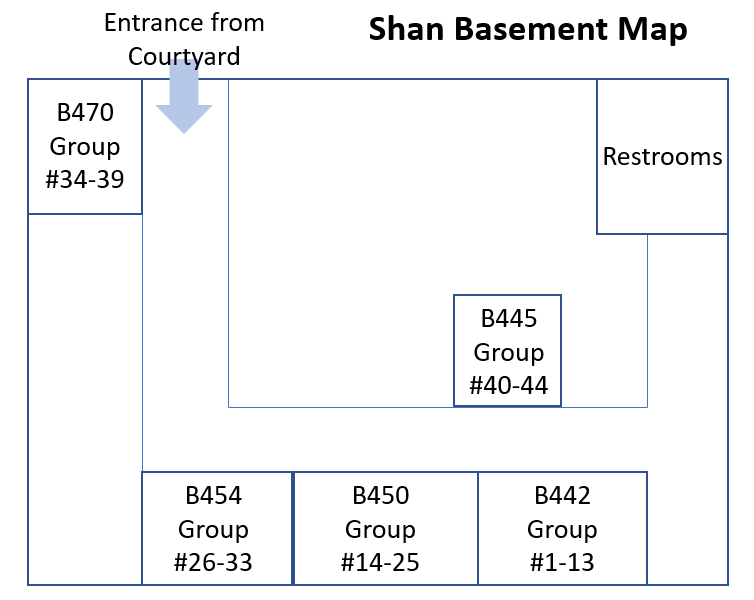

# Group Problems
### (Tuesdays/Thursdays in class)

[Jump to this week's problems](#bottom)

During your scheduled class time, 8:10am-9:25am or 9:35-10:50am on Tuesdays and Thursdays, you will be assigned into a group of 2-3 students to complete two Group Problems. One member of each group will submit a good paper copy of their group’s solutions to the baskets (one per problem) at the front of the room. You will receive a score for completing the problems and feedback from a grader. The score is based largely on a good-faith effort by your group (including starting from first principles, drawing clear diagram(s) and justifying your work), not on getting the correct answer. Group problems are worth 10% of your total grade.

#### In-class logistics

Please arrive on time. This will help us sort out the group logistics.

<!-- 

Please look up [your assigned group number here](https://drive.google.com/file/d/1Cchoi_8i1Y2V-IIaKVr5VBkjPJjUKjd8/view?usp=sharing){:target="_blank"} (updated Week 8). Locations for the group numbers are:

-->

Location: Shan basement

Your specific groups and room # for Week 1-3 will be announced on Monday January 16. 

To help us create productive and happy groups, please fill out this Google Form:
[Group Problem Preferences Form](https://forms.gle/vzyrZ5mEVzcDExau8){:target="_blank"}

Group # | Location
-------| -------
Groups 1-13 | Shanahan B442
Groups 14-25 | Shanahan B450
Groups 26-33 | Shanahan B454
Groups 34-39 | Shanahan B470
Groups 40-44 | Shanahan B445

For the Group Problems, our aim is to not make this feel like a stressful, rushed time together. Although your group might not get through both problems, you will get the majority of the credit for submitting a good-faith effort. Be sure to start by drawing picture(s) and state principle(s) you use.

The group tables will be indicated with a numbered red Solo Cup. Each table will have printouts of both problems to use for your final submission. Be sure to bring scratch paper or a tablet to work on; your group can also use a nearby whiteboard to collaborate.

**When you get together with your group**, decide as a group how you are going to collaborate:
any style preferences (e.g. talking every step through together, or taking 5 minutes alone and then discussing) – be communicative, flexible, and helpful

Decide who will formally write up each problem for submission (one submission per problem per group)

**If your group needs help**: Use your Solo Cup to indicate that your group needs help: **open side up** means your group would like an instructor or grutor to check in.

Solutions for the group problems are made available at noon. We strongly recommend that you check your answers and understanding of these group problems (and any grader feedback) before attempting the “Solo Problems” at the end of each week.

Week 1 |  |  | |
Date | Problem pdf | Solution
---| --- | -- | -- |
Tuesday Jan 17 | [Group Problem Intro Slides](https://docs.google.com/presentation/d/10JbN6rmbFt8YhAQL7U9CPqg-JGGssmm2/edit?usp=sharing&ouid=117002842337913012603&rtpof=true&sd=true){:target="_blank"}   No Group Problem 1 (starts at 2)   [Group Problem 2](https://drive.google.com/file/d/150GK8kMKj-nW0JFEfg_7qhF1wu-S2HvT/view?usp=sharing){:target="_blank"} |    [Group Problem 2 Solution](https://drive.google.com/file/d/1wMvtgtCFFPMW2Td142Mw43AW_ZhDNaOp/view?usp=sharing){:target="_blank"}
Thursday Jan 19 | [Group Problem 3](https://drive.google.com/file/d/1mpcpCSFff_FwHOLNXrbLMYhVxw5O0XBr/view?usp=sharing){:target="_blank"}   [Group Problem 4](https://drive.google.com/file/d/1A0wUGSVsDJfGAwVw_MnUF1h4ZGTIi1Ep/view?usp=sharing){:target="_blank"} | [Group Problem 3 Solution](https://drive.google.com/file/d/1rUiqba4vR9Y6KQS8RXi84l60mfe9uW_O/view?usp=sharing){:target="_blank"}    [Group Problem 4 Solution](https://drive.google.com/file/d/1dUjvrohkQyOV-ebmqzJgMr89PW2mTWsS/view?usp=sharing){:target="_blank"}

 

<!-- 

Week 2 |  |  | |
Date | Problem pdf | Solution
---| --- | -- | -- |
Tuesday Jan 24 | [Group Problem 5](https://drive.google.com/file/d/1jGuThA--fAfWR1PRNz_AI-bAExFpjeAn/view?usp=sharing){:target="_blank"}   [Group Problem 6](https://drive.google.com/file/d/1vD9M35fXHuo9_G_Alo2TzI8M2UoLPWnJ/view?usp=sharing){:target="_blank"} | [Group Problem 5 Solution](https://drive.google.com/file/d/1pT3pCp1VotaccHJWXGUgJ4Ern2F0WB7c/view?usp=sharing){:target="_blank"}   [Group Problem 6 Solution](https://drive.google.com/file/d/1bsmVRAQjdCjEgpgbKSxZ0-BvYVc4axBA/view?usp=sharing){:target="_blank"} 
Thursday Jan 26 | [Group Problem 7](https://drive.google.com/file/d/1S353a9z79xf7Tg4WDrq9hd6kzSRFwM6N/view?usp=sharing){:target="_blank"}   [Group Problem 8](https://drive.google.com/file/d/1z7UVwaBp-kBscsdSwegJdq9ysBiu89_t/view?usp=sharing){:target="_blank"} | [Group Problem 7 Solution](https://drive.google.com/file/d/1v_3G9pFVELPH46e4G-SD7OlWG0A0nGxK/view?usp=sharing){:target="_blank"}   [Group Problem 8 Solution](https://drive.google.com/file/d/133YNbwtB2oUVnBzgHKvElNajxOtuCgSE/view?usp=sharing){:target="_blank"}

 

Week 3 |  |  | |
Date | Problem pdf | Solution
---| --- | -- | -- |
Tuesday Jan 31 | [Group Problem 9](https://drive.google.com/file/d/1ya4OlHRL85EAEb-YbjuwOeinfiRWBKxt/view?usp=sharing){:target="_blank"}   [Group Problem 10](https://drive.google.com/file/d/1i0KWfR96KW55Xw0DF02Zs-0PfdAKo7fW/view?usp=sharing){:target="_blank"}   | [Group Problem 9 Solution](https://drive.google.com/file/d/1f6SO0_BLnHQBnB1GLD11PuOjMSz7FJbG/view?usp=sharing){:target="_blank"}   [Group Problem 10 Solution](https://drive.google.com/file/d/1NMJDQKI7rZsVkY83eVSo-5QclzAx58Ht/view?usp=sharing){:target="_blank"}
Thursday Feb 2 | [Group Problem 11](https://drive.google.com/file/d/1o0QS6h5xlfjPwI0mOQspDVZtLonjK4vR/view?usp=sharing){:target="_blank"}   [Group Problem 12](https://drive.google.com/file/d/1Qmfv_FD9w2BBjGIfDuRNAEwFU6OImrVs/view?usp=sharing){:target="_blank"}  | [Group Problem 11 Solution](https://drive.google.com/file/d/1mikBtmi5oGAGsTXF1AVZGBllnchN813a/view?usp=sharing){:target="_blank"}   [Group Problem 12 Solution](https://drive.google.com/file/d/1aGW-ZUKFrhTLR7ANoA5e-jwuICjhQyqw/view?usp=sharing){:target="_blank"}

 

Week 4 |  |  | |
Date | Problem pdf | Solution
---| --- | -- | -- |
Tuesday Feb 7 | [Group Problem 13](https://drive.google.com/file/d/1WQVeO0rbck5EWg9JOXkNIFqidSw8r-8N/view?usp=sharing){:target="_blank"}   [Group Problem 14](https://drive.google.com/file/d/1-QPrgqKdaXFVB1QdEthroQ7fJ5JxPDVe/view?usp=sharing){:target="_blank"} | [Group Problem 13 Solution](https://drive.google.com/file/d/1J0r91dicnw3q7YXPPbsH6wdSjRH4bNB-/view?usp=sharing){:target="_blank"}   [Group Problem 14 Solution](https://drive.google.com/file/d/1uNONj1e0RDg2jn1cOwZRyA_KSg5XLyzw/view?usp=sharing){:target="_blank"}
Thursday Feb 9 | [Group Problem 15](https://drive.google.com/file/d/1bwYO0nrePg8P6hh4V_G8xiZYOK4BMHfv/view?usp=sharing){:target="_blank"}   [Group Problem 16](https://drive.google.com/file/d/1hAcEvh4GPKV0rh8avT6UsczUW7XzNQJN/view?usp=sharing){:target="_blank"} | [Group Problem 15 Solution](https://drive.google.com/file/d/19QBPn6hlxOa1qeDAclcD56EBGK-H7MqW/view?usp=sharing){:target="_blank"}   [Group Problem 16 Solution](https://drive.google.com/file/d/1jyQrwxf27aSEUeV8IDfyVnRiymkRKlDk/view?usp=sharing){:target="_blank"}

 

Week 5 |  |  | |
Date | Problem pdf | Solution
---| --- | -- | -- |
Tuesday Feb 14 | [Group Problem 17](https://drive.google.com/file/d/1cQodH9A9KpzTZaTPb8c8OulnvO_1JRzb/view?usp=sharing){:target="_blank"}   [Group Problem 18](https://drive.google.com/file/d/1AvzY23_CSu6jgFtLfdZ444DTD1EvkJ2u/view?usp=sharing){:target="_blank"} | [Group Problem 17 Solution](https://drive.google.com/file/d/1zjcUnd7X8HLdrxPLHR5pST7oTS5WqvWf/view?usp=sharing){:target="_blank"}   [Group Problem 18 Solution](https://drive.google.com/file/d/1zjxm5LlKODRf4NI1DDEDyTlIzaqLx0yz/view?usp=sharing){:target="_blank"}
Thursday Feb 16 | [Group Problem 19](https://drive.google.com/file/d/1hggfYZm4sSiSWsTaWLZ3efP6qpujrLdc/view?usp=sharing){:target="_blank"}   [Group Problem 20](https://drive.google.com/file/d/15E3hH0VDL48Kr-kkn7zyuBDeYC0sburk/view?usp=sharing){:target="_blank"} | [Group Problem 19 Solution](https://drive.google.com/file/d/19O0T38Ia9DphJMR3YJZZO8J_LDe9CmLV/view?usp=sharing){:target="_blank"}   [Group Problem 20 Solution](https://drive.google.com/file/d/1IDKCtxWRj5TSgyAkZeUKK8v9P_c6b3fg/view?usp=sharing){:target="_blank"}

 

Week 6 |  |  | |
Date | Problem pdf | Solution
---| --- | -- | -- |
Tuesday Feb 21 | [Group Problem 21](https://drive.google.com/file/d/11bJPTliy8JdwRdJjm8lCSXzB7ceH4XI8/view?usp=sharing){:target="_blank"}   [Group Problem 22](https://drive.google.com/file/d/1_Iy6sLWqae-NSI3slZb0woKSABJ31cCM/view?usp=sharing){:target="_blank"} | [Group Problem 21 Solution](https://drive.google.com/file/d/1fkcaocnOOUMzQtzF58C7YrjRCVpiSBPU/view?usp=sharing){:target="_blank"}   [Group Problem 22 Solution](https://drive.google.com/file/d/1viK_0_yALy-Y2KUhGRw48O0KxgderS0z/view?usp=sharing){:target="_blank"}
Thursday Feb 23 | [Group Problem 23](https://drive.google.com/file/d/1qoZskMKJ6eLm712awEEFXT0hoEzw9Chn/view?usp=sharing){:target="_blank"}   [Group Problem 24](https://drive.google.com/file/d/1iv22_bZTX2chWmSdQBgO-sMH9BTHO83L/view?usp=sharing){:target="_blank"} | [Group Problem 23 Solution](https://drive.google.com/file/d/1PlRxMitgPERFS7gnHDykBbMU3JOLdYqi/view?usp=sharing){:target="_blank"}   [Group Problem 24 Solution](https://drive.google.com/file/d/1xGIjrboajjGf239c83VTylP2O0AnvguM/view?usp=sharing){:target="_blank"}

 

#### Week 7

Tuesday Mar 1 - Q&A about review (no group problems to submit)
[midterm-reivew-problems-with-coversheet.pdf](https://drive.google.com/file/d/1G9LkXlp58wkSYbxn1LgUSJkcHdBELae9/view?usp=sharing){:target="_blank"}

[midterm-review-problems-solutions.pdf](https://drive.google.com/file/d/1G9Dlzkf0MsfrXQhN0cZx1sxJ5Pqt_ayC/view?usp=sharing){:target="_blank"}

Thursday Mar 3 - *Midterm Exam**

Our midterm exam (75 minutes long) will take place in-person on Thursday March 2 8:10-9:25am or 9:35-10:50am in your usual Group Problem location. 

 

Week 8 |  |  | |
Date | Problem pdf | Solution
---| --- | -- | -- |
Tuesday Mar 7 | [Group Problem 25](https://drive.google.com/file/d/1LxAibcrORHLaIxKbrLhS1XFbagW0za7j/view?usp=sharing){:target="_blank"}   [Group Problem 26](https://drive.google.com/file/d/1pIH87qY4_doposrfSeXnGqJxC9K8xYPd/view?usp=sharing){:target="_blank"} | [Group Problem 25 Solution](https://drive.google.com/file/d/12s2rDDjmBZxowxyhnNdP4ojkveAf6A8d/view?usp=sharing){:target="_blank"}   [Group Problem 26 Solution](https://drive.google.com/file/d/1XqHNooY5CJ1h4o-37pyxdBRB0TJrTena/view?usp=sharing){:target="_blank"}
Thursday Mar 9 | [Group Problem 27](https://drive.google.com/file/d/1s48fnwMfp7p6dRAgR5rDRT2hlPE2IPuD/view?usp=sharing){:target="_blank"}   [Group Problem 28](https://drive.google.com/file/d/1jcBbbe5tOiSHMRaQpsYiuxmC9CLu4TmX/view?usp=sharing){:target="_blank"} | [Group Problem 27 Solution](https://drive.google.com/file/d/17d5ixK3BxzuGdzBib93ZKyjEBUV3OI2C/view?usp=sharing){:target="_blank"}   [Group Problem 28 Solution](https://drive.google.com/file/d/1KJaoTEbnSOJcrNnootuvcWhw-71n4Cfj/view?usp=sharing){:target="_blank"}

 

Week 9  |  |  | |
Date | Problem pdf | Solution
---| --- | -- | -- |
Tuesday Mar 21 | [Group Problem 29](https://drive.google.com/file/d/1I40wfxrrpvjGGUhmqApgZuSrkzAfM-cy/view?usp=sharing){:target="_blank"}   [Group Problem 30](https://drive.google.com/file/d/1qSBXzsLdXmsr6w4oKQpBr4RlsuvV4hXT/view?usp=sharing){:target="_blank"} | [Group Problem 29 Solution](https://drive.google.com/file/d/1jryVJ66BPLZvzBgAl6B_ZfU3ntSaf-Y4/view?usp=sharing){:target="_blank"}   [Group Problem 30 Solution](https://drive.google.com/file/d/1zggkHkrPTkJXNWFatmMCC0XpbXVWWaxK/view?usp=sharing){:target="_blank"}
Thursday Mar 23 | [Group Problem 31](https://drive.google.com/file/d/1659QWqIGFqJZAe1X5KvvctiATfnp4pLU/view?usp=sharing){:target="_blank"}   [Group Problem 32](https://drive.google.com/file/d/1IbsGN3vhSon9Ixlau9IL5SSeYwNomfkz/view?usp=sharing){:target="_blank"} | [Group Problem 31 Solution](https://drive.google.com/file/d/1xWv3lMm2V98Q-13ax_ATRmh3p0LAbbiX/view?usp=sharing){:target="_blank"}   [Group Problem 32 Solution](https://drive.google.com/file/d/1DZFwhYkOFJkX6wEEDJ3BpKhZUOvYmyfp/view?usp=sharing){:target="_blank"}

 

Week 10  |  |  | |
Date | Problem pdf | Solution
---| --- | -- | -- |
Tuesday Mar 28 | [Group Problem 33](https://drive.google.com/file/d/1EsOmyF1Tf-8kQa323b4hQbsY58HoT9SO/view?usp=sharing){:target="_blank"}   [Group Problem 34](https://drive.google.com/file/d/1uMXkV8wVN7Ee07EM4uVOuEKoYhlb9JMs/view?usp=sharing){:target="_blank"} | [Group Problem 33 Solution](https://drive.google.com/file/d/1cXpkPGPgwW7s3jXY4x3GsALqKbqJM27t/view?usp=sharing){:target="_blank"}   [Group Problem 34 Solution](https://drive.google.com/file/d/1Q6A3m-r3dq1RA2KGIWfvHArsr_oCBsu7/view?usp=sharing){:target="_blank"}
Thursday Mar 30 | [Group Problem 35](https://drive.google.com/file/d/1kHK9qNR-GFaWsQ_iQx8BYAXtj5LiBE8f/view?usp=sharing){:target="_blank"}   [Group Problem 36](https://drive.google.com/file/d/128YnfYIFLsN0BKPan4LFYeZDROd1Zlvt/view?usp=sharing){:target="_blank"} | [Group Problem 35 Solution](https://drive.google.com/file/d/1E-dwzn0AV__y7ZiCxGNjGKi6CIgmV2-L/view?usp=sharing){:target="_blank"}   [Group Problem 36 Solution](https://drive.google.com/file/d/1bY3x-KV8lfiLBqdNgPH2BRmOg8hx2fWH/view?usp=sharing){:target="_blank"}

 

Week 11 |  |  | |
---| --- | -- | -- |
Tuesday Apr 4 | [Group Problem 37](https://drive.google.com/file/d/18NMCCBZJyrvKO5E4wIOlGoTkkzOHKVLU/view?usp=sharing){:target="_blank"}   [Group Problem 38](https://drive.google.com/file/d/1yC_Nb5K3cXCCYaByWGK2qPVCZRUwWw03/view?usp=sharing){:target="_blank"} | [Group Problem 37 Solution](https://drive.google.com/file/d/1SxNCRFw6bybW92P6IQ2oetNtyXghM-Qw/view?usp=sharing){:target="_blank"}   [Group Problem 38 Solution](https://drive.google.com/file/d/1fcrnEOPyuJpnmAV02V3WiuIiAHK3mD0K/view?usp=sharing){:target="_blank"}
Thursday Apr 6 | [Group Problem W11Th](https://drive.google.com/file/d/1nmaCX153C1WhRJsy_cZNmx8T9DBxKTtR/view?usp=sharing){:target="_blank"} | [Group Problem W11Th Solution](https://drive.google.com/file/d/1DaMsFXRri-8XoMTOsEA70fIi6j02qiPd/view?usp=sharing){:target="_blank"}

 

Week 12 |  |  | |
---| --- | -- | -- |
Tuesday Apr 11 | [Group Problem 39](https://drive.google.com/file/d/1-fhLxGHGg2U3sgNayY22aMorqvqecg3l/view?usp=sharing){:target="_blank"}   [Group Problem 40](https://drive.google.com/file/d/1-z9-5DcyPiviH0VfmcmnLl1TDAUHGkWL/view?usp=sharing){:target="_blank"} | [Group Problem 39 Solution](https://drive.google.com/file/d/1sBG2w228qwYxVRw5csm_wrtPZERbhhDe/view?usp=sharing){:target="_blank"}   [Group Problem 40 Solution](https://drive.google.com/file/d/1LEt5xFV382MPsHEfoorPmkyMo25rlNGs/view?usp=sharing){:target="_blank"}
Thursday Apr 13 | [Group Problem 41](https://drive.google.com/file/d/1cP-rZXSjnDXWk1T0QcgwpwAFoi40dGYi/view?usp=sharing){:target="_blank"}   [Group Problem 42](https://drive.google.com/file/d/1Lmrf_hSzvqNItBJULkaV-CHuygVA3vGW/view?usp=sharing){:target="_blank"} | [Group Problem 41 Solution](https://drive.google.com/file/d/1m84B7LBGLxg1bOPLBjd6ko9LmDjOjPPu/view?usp=sharing){:target="_blank"}   [Group Problem 42 Solution](https://drive.google.com/file/d/1tgQR82-88kP02XVFRo3YHLxfHbAzeKOE/view?usp=sharing){:target="_blank"}

 

Week 13 |  |  | |
---| --- | -- | -- |
Tuesday Apr 18 | [Group Problem 43](https://drive.google.com/file/d/1Z2o14QkHioo3SqT9mre3WPmCPy-3FYag/view?usp=sharing){:target="_blank"}   [Group Problem 44](https://drive.google.com/file/d/1R4bEThJPY5ktTcotfAHfdHjkuRmfHvIb/view?usp=sharing){:target="_blank"} | [Group Problem 43 Solution](https://drive.google.com/file/d/1WRAQacIzuDDkKsOEFZBGw6FF9k1OPT86/view?usp=sharing){:target="_blank"}   [Group Problem 44 Solution](https://drive.google.com/file/d/149khstjgmPuh5Tvr6-BGMb9G_ngM5Jma/view?usp=sharing){:target="_blank"}
Thursday Apr 20 | [Group Problem 45](https://drive.google.com/file/d/1-2irQurPumCF6j7XwQaWPzJSYESsC8YH/view?usp=sharing){:target="_blank"}   [Group Problem 46](https://drive.google.com/file/d/1ysR-b5vvhaMzA4BD_QfH6DfxpNLXozpb/view?usp=sharing){:target="_blank"} | [Group Problem 45 Solution](https://drive.google.com/file/d/1GsGNr1_G482jazbwkf_3vnHZRIGzxEQP/view?usp=sharing){:target="_blank"}   [Group Problem 46 Solution](https://drive.google.com/file/d/12JnNG0v29uRMlEi3XmvFHeFOYLt7oAwT/view?usp=sharing){:target="_blank"}

 

Week 14 |  |  | |
---| --- | -- | -- |
Tuesday Apr 25 | [Group Problem 47](https://drive.google.com/file/d/1lV0vkyrvoO2JrEicBsAkSl5aU_9t1qSS/view?usp=sharing){:target="_blank"} | [Group Problem 47 Solution](https://drive.google.com/file/d/1O-Q5cPezBRaKjqqBi5MO7B-7v7KS1SJl/view?usp=sharing){:target="_blank"}
Thursday Apr 27 | No Group Problems - Final Lecture in Galileo

-->

 

 

 

